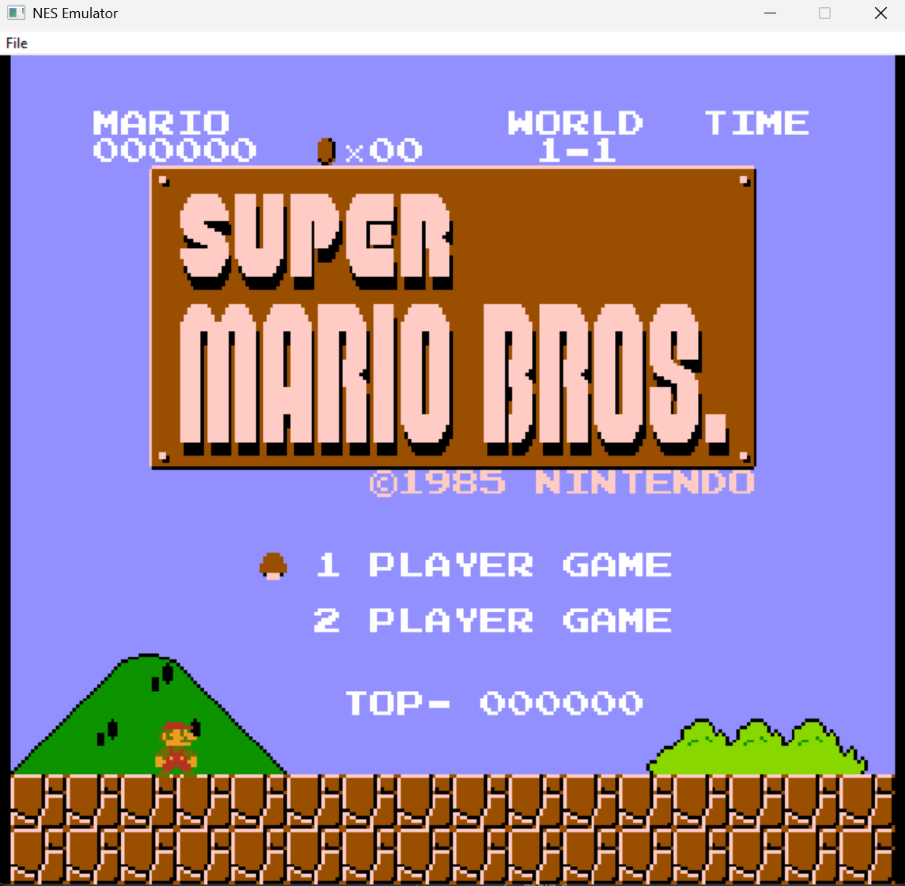
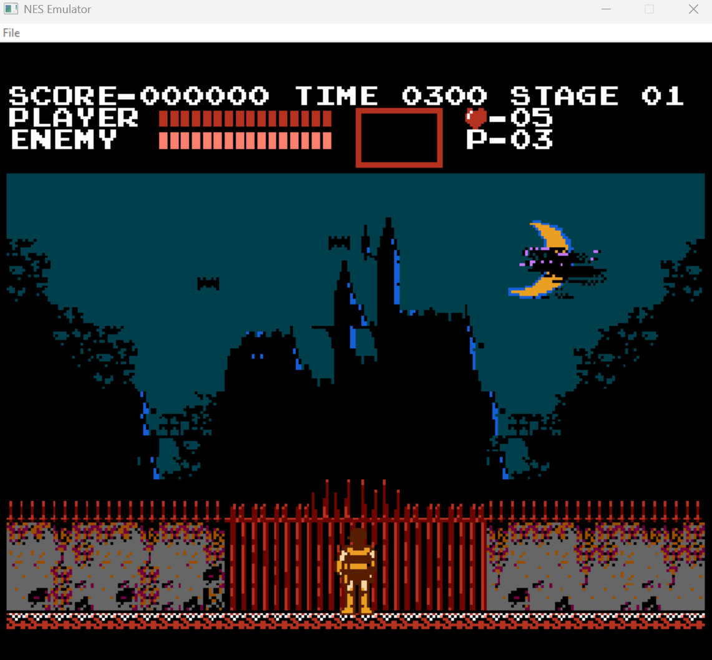

# NES Emulator (Working Title)

A work‑in‑progress Nintendo Entertainment System emulator written in C, using SDL2 for graphics and input. The project focuses on correctness-first CPU/PPU emulation, a simple UI, and a clean CMake build that fetches SDL2 automatically.

This README covers how to build and run it, what currently works, known limitations, and a few name ideas for the emulator. If you plan to showcase games running on it, there’s a screenshots section ready to drop images into.

## Status

- CPU/PPU core running with background + sprite rendering
- Controller 1 (keyboard) supported
- iNES/NES 2.0 headers parsed
- Mappers: NROM (0) and UxROM (2) implemented; others stubbed
- Windows native File → Open ROM menu

Limitations:

- Audio (APU) not implemented yet
- Only 1 controller mapped; JOY2 is disabled
- Mapper coverage is limited (MMC1/3/5, CNROM not yet wired)
- Non‑Windows builds do not have a native file dialog (use CLI)
- Known visual bugs on a couple of games

## Build

Prerequisites:

- CMake 3.16+
- A C compiler and build tools
  - Windows: Visual Studio 2022 (MSVC)
  - macOS: Xcode CLT (clang)
  - Linux: GCC/Clang + build‑essentials
- Internet access (CMake will FetchContent SDL2 automatically)

Clone and build (Release):

```bash
git clone https://github.com/pedrocriado/NES-EMULATOR.git
cd NES-EMULATOR
cmake -S . -B build
cmake --build build
```

The executable is created as:

- Windows: `build/Debug/nes.exe`

SDL2 is fetched and built as part of the project; you don’t need to install it system‑wide.

## Run

You can pass a ROM path on the command line, or on Windows open it via the menu.

```bash
# From the project root (example using a ROM inside nes_files)
./build/Debug/nes ./path/to/file/file.nes
```

Windows also exposes a native File → Open ROM… menu. On macOS/Linux, use the CLI path argument for now.

ROMs are searched relative to `./nes_files/` when you provide a bare name without extension. Saves are written to `./nes_files/saves/` when the cartridge provides PRG NVRAM (NES 2.0).

## Controls

- D‑Pad: Arrow keys
- A: `Z`
- B: `X`
- Select: `G`
- Start: `F`

Note: Only controller 1 is currently mapped.

## Compatibility

- File formats: iNES and NES 2.0 headers
- Mappers:
  - Implemented: NROM (0), UxROM (2)
  - Planned/Stubbed: MMC1 (1), CNROM (3), MMC3 (4), MMC5 (5)

Known good tests/games will be added over time. Expect many commercial games to require additional mappers and APU to be fully playable.

## Screenshots

Below are some screenshots taken from the games running on the emulator:

_Super Mario Bros._


_Castlevania_


## Project Layout

- `src/` – Emulator sources (CPU6502, PPU, bus, cartridge, controller, SDL2 graphics)
- `src/Mappers/` – Mapper implementations
- `nes_files/` – Place your ROMs here (ignored in .git); saves in `nes_files/saves/`
- `CMakeLists.txt` – Build configuration (FetchContent SDL2)

## Roadmap (WIP)

- Implement APU (audio) core and mixing
- Wire additional mappers (MMC1, CNROM, MMC3, MMC5)
- Native file dialog on macOS/Linux; common shortcuts
- Second controller and configurable key bindings
- Compatibility test suite + CI builds

## Legal

This project does not provide or endorse distribution of copyrighted ROMs. Use your own legally obtained ROM backups. Some public test ROMs are widely available for verification and debugging.

## License

- Project license: MIT — see `LICENSE`.
- SDL2 is used under the zlib license (via FetchContent). If you redistribute static binaries, ensure you retain SDL2’s license notice. See: https://libsdl.org/license.php
